# Project 2: Robot Automation
---
Industrial AI & Automation 2025

**Name:** Inyeop Kim

**Date:** 2025/12/27

**github link**
https://github.com/Joungbin-C/IAIA_Robot_Automation_25-2

**Demo link**
[IAIA Robot Automation](https://www.youtube.com/watch?v=vMVNzXjdA7o)
## I. Introduction
---
With the rapid growth of the electric vehicle (EV) market, the secondary battery industry has emerged as a key strategic sector. It is projected that by 2030, electric vehicles will account for more than 40% of the global automotive market, leading to a significant increase in battery production demand. However, conventional battery cell assembly and disassembly processes remain highly dependent on manual labor, resulting in limitations in productivity, process consistency, and quality control. In particular, as the importance of battery recycling and safe disassembly increases, there is a growing demand for intelligent automation systems capable of handling precise and complex operations beyond simple assembly tasks.

| 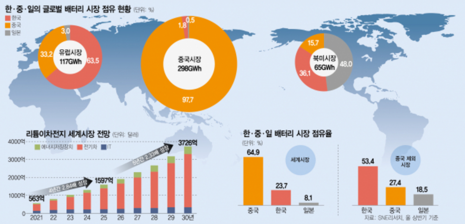 |
| :-----------------------------------------------: |
|        **Figure 1.** Battery Market Share         |
This project aims to address these challenges by developing an **automated battery cell winding process using industrial robots integrated with machine vision and artificial intelligence technologies**. By combining robotic manipulation, sensor-based detection nodes, state diagram–based control logic, and camera-based recognition of battery cells and winding components, the project seeks to transform a labor-intensive process into a high-speed, high-precision automated system. Through this approach, the feasibility of improving productivity, reliability, and safety in battery manufacturing and recycling processes is investigated.

## II. Problem Statement
---
### 1. Problems
1. Minor process deviations create potential defects, leading to battery failures and safety hazards.
    
2. In mass production, significant process variation creates challenges in ensuring uniformity.
    
3. Conventional defect inspection methods are slow and only detect surface defects.

| 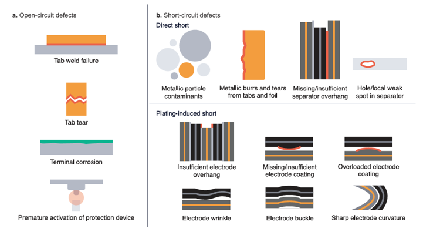 |
| :---------------------------------------: |
|     **Figure 2.** Cell Problem Types      |

### 2. Project Objectives

The main objectives of this project are as follows:

1. **Implementation of Automated Assembly and Disassembly of Battery Cell Winding Processes**
    To automate the assembly and disassembly of battery cells and winding components using industrial robots, thereby minimizing human error and improving repeatability.
2. **Development of a Machine Vision–Based Recognition System**
    To detect battery cell positions, orientations, and conditions (normal or defective) using camera-based vision systems and AI models, and to integrate the recognition results into the robot control system.
3. **Design of Robot Control Logic and State Diagrams**
    To design structured state diagrams that manage process flow and ensure stable coordination between sensor detection nodes and robotic actions.
4. **Verification of Process Reliability and Performance**
    To experimentally evaluate the success rate, accuracy, and operational stability of the automated system and assess its applicability to real industrial environments.

### 3. Expected Outcomes

The expected outcomes of this project are as follows:

1. **Improved Productivity and Operational Efficiency**
    By replacing manual labor with robotic automation, continuous operation beyond traditional working hours becomes possible, significantly increasing overall productivity.
2. **Enhanced Accuracy and Quality Consistency**
    The automated system is expected to achieve a high success rate in assembly and disassembly tasks, while the machine vision system enables reliable identification of normal and abnormal battery cells, excluding specific inclusion cases.
3. **Reduced Labor Dependency and Improved Workplace Safety**
    Automating repetitive and potentially hazardous battery handling processes reduces worker exposure to risk and lowers dependence on skilled manual labor.
4. **Scalability for Battery Recycling and Future Smart Factory Applications**
    The proposed system can be extended to battery disassembly and recycling processes, providing a technological foundation for advanced smart factory and sustainable battery production systems.

### 4. Evaluation Index

|          Process           |                                                                                                                                    Target                                                                                                                                    |
| :------------------------: | :--------------------------------------------------------------------------------------------------------------------------------------------------------------------------------------------------------------------------------------------------------------------------: |
|  **UR5 Robot Operation**   |                 - Bracket detection success rate ≥ 98% <br />- Cell box detection success rate = 100% <br />- Pick and Place success rate ≥ 95% <br />- Stopper linkage success rate = 100% <br />- Assembly/Disassembly process completion time ≤ 1 minute                  |
| **Indy10 Robot Operation** | - Cell orientation detection success rate = 100% <br />- Foreign object detection success rate ≥ 95% <br />- Defective cell detection success rate ≥ 95% <br />- Stopper linkage success rate = 100% <br />- Winding assembly/disassembly process completion time ≤ 1 minute |
|    **Defect Detection**    |                                                                            - Defect detection success rate (cylindrical surface) ≥ 95% <br />- Defect detection success rate (flat surface) ≥ 80%                                                                            |

## III. Requirements
---
### 1. Hardware List

- UR5e
	- 2-finger gripper
- Cell & Wind

| 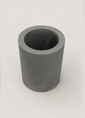 | 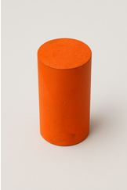 |
| :---------------------: | :---------------------: |
|   **Figure 3A.** Cell   |   **Figure 3B.** Wind   |
- Bracket

| 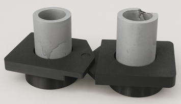 |
| :---------------------------: |
|     **Figure 4.** Bracket     |
- Cell Box
- Slide Rail
- Stepper Moters & Stopper
- Ultrasonic Sensor

### 2. Software List

- OS: Linux Ubuntu 20.04
- ROS: ROS Noetic
- Additional Packages Required
	- OpenCV
	- numpy
- Additional Ubuntu Utility Programs
	- Python 3.10.8
	- terminator
To build overall software setting, follow the [link](https://github.com/ykkimhgu/HGU_IAIA/tree/main/Tutorial/TU_ROS_v2) for extra guideline.
## IV. Procedure
---
This report covers the camera-based cell and winding **disassembly and assembly automation process (UR robot)**.
- [disassembly and assembly automation](https://github.com/Kiminyeop-cpu/Robot-Automation/blob/main/Battery%20Cell%20Winding%20Process.pdf)

Process recognition-based **pick and place automation (Indy10)** and deep learning-based **cell defect detection** are covered in the following links.

- [pick and place automation](https://github.com/shg0873/IAIA/blob/main/Project/Project2_RobotAutomation/Report)
- [cell defect detection](https://github.com/Joungbin-C/IAIA_Robot_Automation_25-2/blob/main/Report/Report_MachinVision.pdf)

### 1. Overview

This system's process involves recognizing objects using image processing techniques, then using relative coordinate-based robot control to precisely grasp and place them in designated locations. Process stability is ensured through a step-by-step structure of detection, correction, movement, and gripping. Furthermore, the robot detects whether cells are present in a cell box and determines the appropriate assembly and disassembly processes accordingly.

### 2. Logic Design

Based on the tasks listed above, the system's flowchart is drawn as below:


| 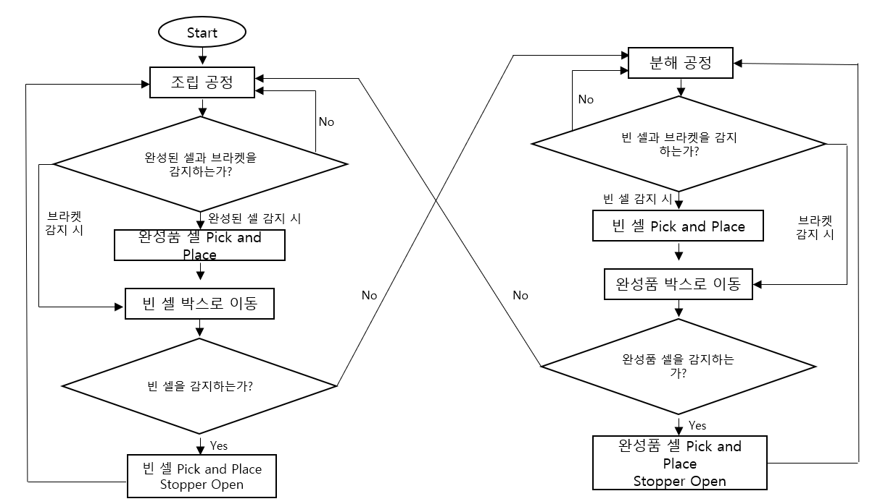 |
| :--------------------------------------: |
|       **Figure 5.** State Diagram        |

### 3. Assembly Process

- **State 1**: First Bracket Detection (State 2 if Composite is detected, State 5 if Bracket is detected)
- **State 2**: Place Composite in Cell Box, then State 3
- **State 3**: Second Bracket Detection (State 4 if Composite is detected, State 6 if Bracket is detected)
- **State 4**: Place Composite in Cell Box, then State 5
- **State 5**: Pick a cell from the cell box, place it on the bracket, then State 6 (if no cell is in the cell box, then State 101 (Disassembly Process))
- **State 6**: Pick a cell from the cell box, place it on the bracket, then reset to State 1 (if no cell is in the cell box, then State 201 (Disassembly Preparation Process))

### 4. Disassembly Process

- **State 101**: First Bracket Recognition (State 102 for cell detection, State 105 for bracket detection)
- **State 102**: Place the cell in the cell box, then State 103
- **State 103**: Second bracket recognition (State 4 for cell detection, State 106 for bracket detection)
- **State 104**: Place the cell in the cell box, then State 5
- **State 105**: Pick the composite from the cell box, then place it on the bracket, then State 106 (if there is no composite in the cell box, then State 1 (assembly process))
- **State 106**: Pick the composite from the cell box, then place it on the bracket, then reset to State 101 (if there is no composite in the cell box, then State 301 (assembly preparation process))

### 5. Disassembly Preparation Process

- **State 201**: First bracket recognition (if there is a composite, place it in the cell box, then State 101 (disassembly process) and State 202 for bracket detection)
- **State 202**: Detect a composite in the second bracket, place it in the cell box, and switch to State 101 (disassembly process).

### 6. Assembly Preparation Process

- **State 301**: First bracket recognition (if a cell is detected, place it in the cell box, then switch to State 1 (assembly process). If a bracket is detected, switch to State 302.)

- **State 302**: Detect a cell in the second bracket, place it in the cell box, and switch to State 1 (assembly process).

### 7. Image Processing

The following image processing was used to identify the battery cell and assembly/disassembly process status.

**1. yellow_bracket_detection_node.py**
- This sensor node detects the bracket holes in the yellow bracket.
	**Bracket (yellow circle) detection**
```python
mask = cv2.inRange(hsv, [20,120,120], [32,255,255])
circles = cv2.HoughCircles(mask, cv2.HOUGH_GRADIENT,
                           dp=1.2, minDist=190,
                           minRadius=210, maxRadius=430)
x, y, r = max(circles, key=lambda c: c[2])

```

- HSV-based yellow segmentation followed by Hough Circle circular bracket detection.
- Since the brackets are of constant size, false detections can be eliminated within the radius range.

	**EMA Filter**
```python
x = (1-α)*x_prev + α*x
y = (1-α)*y_prev + α*y
```

- Removing frame-to-frame positional blur with EMA filters

| 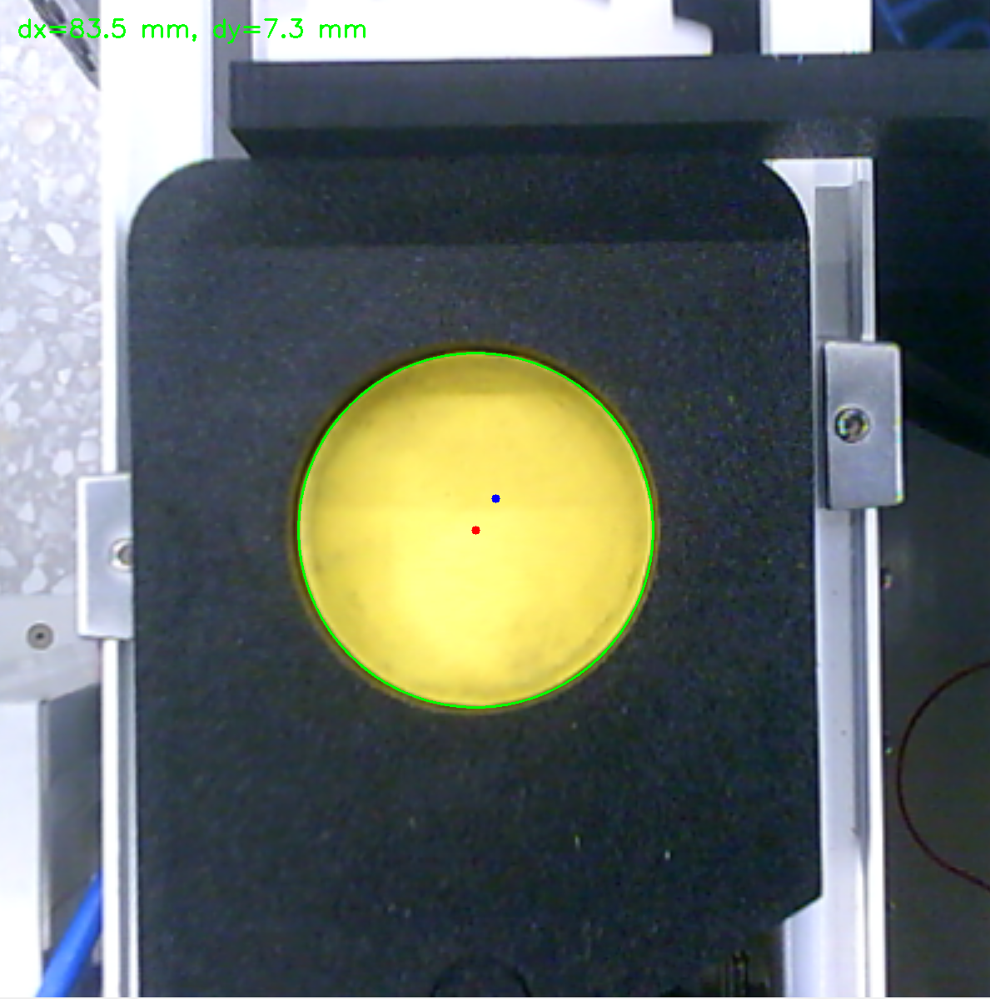 |
| :-----------------------------------------------------------: |
|                **Figure 6.** Bracket Detection                |

**2. filled_cellbox_detection_node.py**
- This detection node detects cells in an empty cell box.
	**Cell box brightness detection technique (classical image processing)**
```python
bright_mask = np.all(cell_roi >= 215, axis=2)
ratio = np.sum(bright_mask) / cell_area
```
- This detection technique is a classical computer vision method that uses RGB color space-based threshold brightness detection.
- Pixels within each cell region whose R, G, and B channel values ​​all exceed a threshold are defined as bright pixels. If the area ratio of these pixels exceeds a threshold, the cell is determined to be detected.

| 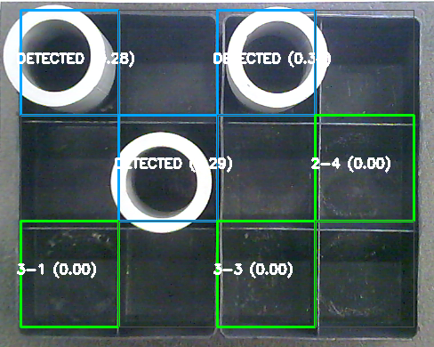 |
| :------------------------------------------------------------: |
|            **Figure 7.** Cell Detection in Cellbox             |

**3. empty_composite_cellbox_detection_node.py**
- This detection node detects empty boxes in the composite cell boxes.
	**Cell detection technique (classical image processing)**
```python
mean_intensity = np.mean(cell_region)
if mean_intensity < 90:
    detected = True
```
- This technique is a classical computer vision method that uses grayscale average intensity-based threshold detection.
- If the mean intensity of each grid cell area falls below a threshold, the cell is considered dark and is then detected as a location for a composite cell.

| 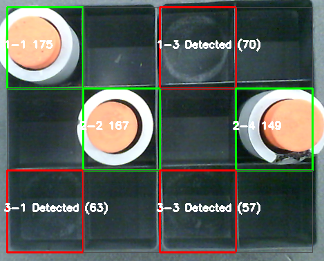 |
| :-----------------------------------------------------------------------------: |
|                  **Figure 8.** Empty Composite Cell in Cellbox                  |

**4. filled_composite_cellbox_detection_node.py**
- This detection node detects composite cells in the finished cell box.
	**Composite cell detection core logic**
```python
orange_mask = cv2.inRange(cell_roi,
                          (65,110,220), (185,220,255))
ratio = np.sum(orange_mask > 0) / cell_area
```
- This node is a classical computer vision technique that uses threshold color detection based on the RGB (BGR) color space.
- If the percentage of pixels within each cell that fall within the orange range exceeds a certain threshold (≥5%), then the cell is considered detected.

| 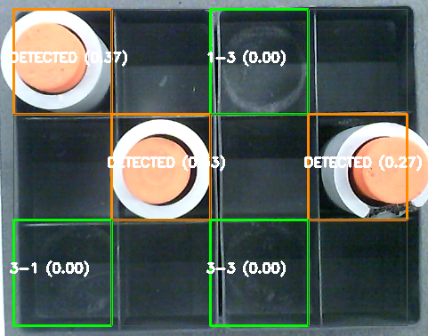 |
| :----------------------------------------------------------------------------------: |
|                    **Figure 9.** Filled Composite Cell in Cellbox                    |

**5. empty_cell_cellbox_detection_node.py
- This detection node detects empty spaces in empty cell boxes.
	**Empty space detection core logic**
```python
black_mask = cv2.inRange(hsv_roi, lower_black, upper_black)
```
- It is a threshold-based classical image processing technique that determines the presence of a black object based on the ratio of pixels with low brightness (V) in the HSV color space.

| 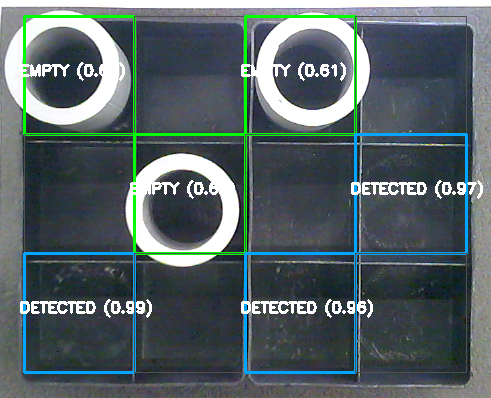 |
| :------------------------------------------------------------------------: |
|                    **Figure 10.** Empty Cell in Cellbox                    |

**6. winding_decect_node.py**
- This sensor node detects the wind.
	**Wind detection core logic**
```python
circles = cv2.HoughCircles(gray_blurred, cv2.HOUGH_GRADIENT, ...)
orange_ratio = orange_pixels_inside_circle / circle_area
```
- It is a classical image processing technique that detects circular objects using grayscale-based Hough Circle Transform and determines them as valid objects only when the proportion of orange pixels inside the detected circle exceeds a threshold.

**7. composite_detection.py**
- This detection node detects the composite cell.
	**Composite cell detection core logic**
```python
circles = cv2.HoughCircles(gray_blurred, cv2.HOUGH_GRADIENT, ...)
```
- It is a classical image processing technique that detects circular objects by applying Hough Circle Transform to a grayscale threshold image within the central ROI, and determines them as valid locations only when the center distance condition is satisfied.

| 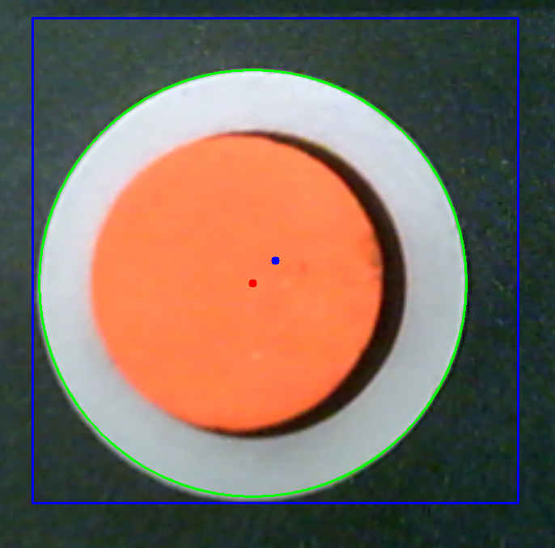 |
| :--------------------------------------------------: |
|          **Figure 11.** Composite Detection          |

**8. cell_detection.py
- This detection node detects empty cells.
	**Empty cell detection core logic**
```python
circles = cv2.HoughCircles(gray_blurred, cv2.HOUGH_GRADIENT, ...)
```
- It is a rule-based classical image processing technique that detects circular objects by applying Hough Circle Transform to grayscale threshold images, and judges them as pure gray objects only when the orange/yellow ratio inside the circle is below the threshold.

| 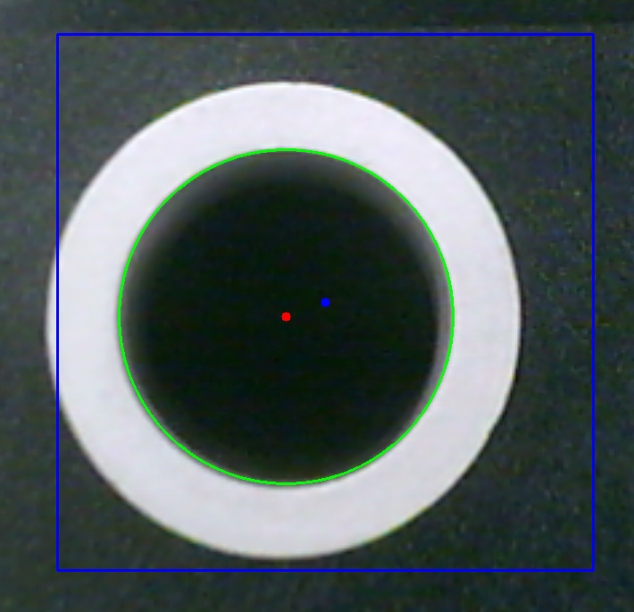 |
| :----------------------------------------: |
|       **Figure 12.** Cell Detection        |

### 8. Pick and Place Algorithm(Manipulation)

**1. Joint-based locomotion (MoveJ)**
```python
def goJ(self, arr_deg, label=""):
    ok = self.ur5e.go_to_joint_abs(self.jdeg(arr_deg))
    rospy.sleep(1.5)
    return ok
```
- Meaning: Move the UR5e relative to absolute joint coordinates using a predefined array of joint angles.
- Usage: Stable pose transitions, such as observation poses, grid access, and return poses.

**2. Cartesian movement based on relative coordinates (XY/Z separation)**
```python
self.ur5e.go_to_pose_rel([dx, dy, 0.0], [0, 0, 0])
self.ur5e.go_to_pose_rel([0.0, 0.0, -0.07], [0, 0, 0])
```
- Meaning: Relative movement relative to the current TCP
- Features: After moving in the XY plane, only the Z axis is lowered/raised → Minimizes collisions
- Usage: Vision-based fine-position correction pick-and-place

**3. Pick Basic Sequence**
```python
# XY 이동
self.ur5e.go_to_pose_rel([dx, dy, 0.0], [0,0,0])
# Z 하강
self.ur5e.go_to_pose_rel([0.0, 0.0, -0.07], [0,0,0])
# 그립 ON
self.grip_on_6s()
# Z 상승
self.ur5e.go_to_pose_rel([0.0, 0.0, 0.115], [0,0,0])
```
- Meaning: Typical industrial robot pick sequence
- Feature: Reuse of the same structure for all pick operations

**4. Grid-based Pick Cycle (Reusable Blocks)**
```python
def pick_cycle(self, pose_dict, cell_key, grip_mode="off"):
    self.goJ(p["start"])
    self.goJ(p["pick"])
    if grip_mode == "on": self.grip_on_6s()
    else: self.grip_off_6s()
    self.goJ(p["start"])
```
- Meaning: Cell name (e.g., "2-3") → Automatically execute the corresponding joint pose.
- Usage:
	- Move to the grid containing the cell. 
	- Later, calculate the relative coordinates and execute Pick or Place.

**5. State-based robot motion transition (FSM)**
```python
if self.state == 1: self.state_1()
elif self.state == 5: self.state_5()
elif self.state == 101: self.state_101()
```
- Meaning: Manage robot motion scenarios as states based on detection results.
- Features:
	- Assembly Process
	- Disassembly Process

This system consists of an industrial robot control logic that combines joint-based movement and Cartesian relative movement and performs pick-and-place operations through an FSM structure.

## V. Results
---
### 1. Results

The test was performed a total of 100 times, and the process time was measured from the moment the stopper contacted the bracket until the stopper opened after the process was completed. The results are as follows.


| Process                                     |                                                    Goal                                                    |                                                     Result                                                     |
| ------------------------------------------- | :--------------------------------------------------------------------------------------------------------: | :------------------------------------------------------------------------------------------------------------: |
| Detection                                   |              - Bracket detection success rate ≥98%<br>- Cell box detection success rate =100%              |              - Bracket Detection Success Rate = 100%<br>- Cell Box Detection Success Rate = 100%               |
| Pick and Place                              |                                     - Pick and Place Success Rate ≥95%                                     |                                      - Pick and Place Success Rate = 97%                                       |
| Stopper linkage and process completion time | - Stopper Interlock Success Rate = 100%<br>- Assembly/Disassembly Process Completion Time: Within 1 Minute | - Stopper Interlock Success Rate = 100%<br>- Assembly/Disassembly Process Completion Time: 1 minute 35 seconds |

### 2. Discussion

1. While the pick-and-place operation met the target performance indicator of a success rate of over 95%, the battery cell assembly and disassembly process requires precise analysis, as even a single failure can impact the overall process quality. The reason is that the `go_to_joint_rel()` function used in relative coordinate-based control sets the positioning error tolerance to 0.003, allowing for a maximum error of approximately 3 mm. However, indiscriminately reducing this tolerance value improves positioning accuracy, but there is a trade-off: increased path calculation time and overall process delays. Therefore, more detailed adjustments to the tolerance value are necessary to simultaneously satisfy the required process accuracy and computational efficiency.
2. The target process time of less than one minute was not met, requiring further analysis in this area. The Cartesian technique, which directly specifies the spatial coordinates (X, Y, Z) of the robot and moves it, has no risk of sign inversion of the posture (yaw, pitch, roll) and can secure high precision because the path is calculated by dividing it into intervals of about 2 mm. However, it has the limitation of relatively slow process speed. On the other hand, the Euler technique, which directly controls the posture (yaw, pitch, roll) of the end-effector, has fast movement speed, but a serious problem has been observed in which the sign inversion of the posture occurs in certain situations and the robot posture suddenly becomes distorted, which acts as a clear trade-off. In addition, a delay of about 1.5 seconds occurred in the process of calling the detection node in a callback manner, which is believed to be caused by the ROS communication structure itself rather than the delay caused by `rospy.sleep()`.
3. Since the image processing was performed based on the lighting standard of NTH 115, detection and pick and place may become more inaccurate when exposed to other lighting environments.
4. If neither the Cell nor the Composite box contains a single cell, the ur5e robot will continue to switch between process states. Therefore, at least one cell must be present in each box.
5. The Cell box must have a Cell in its proper location, and the Composite box must have a Composite Cell in its proper location. Otherwise, the cell will not be recognized.

## VI. Conclusion
---
By introducing a process-aware pick and place automation system, operating hours can be significantly extended compared to existing human-driven processes, enabling continuous 24-hour operation. While the cycle time was somewhat long at 1 minute and 35 seconds, and only two cells were picked and placed per cycle, this project demonstrated the feasibility of fully unmanned pick and place, suggesting potential savings in labor and operating costs.
Future research will focus on shortening the overall process execution time and enhancing the precision of image processing detection to ensure a near-zero pick and place failure rate.

## VII. Reference

1. 박예나. (2024년 11월 17일). “배터리 삼국지”… 中 질주 속 K배터리의 난제는. 서울경제. [https://www.sedaily.com/NewsView/29X4QWC74S](https://www.sedaily.com/NewsView/29X4QWC74S)

2. Attia, P. M., Moch, E., & Herring, P. K. (2025). Challenges and opportunities for high-quality battery production at scale. Nature Communications, 16, 611. [https://doi.org/10.1038/s41467-025-55861-7](https://doi.org/10.1038/s41467-025-55861-7)

3. Jiang, X., Gramopadhye, A.K., Melloy, B.J. and Grimes, L.W. (2003), Evaluation of best system performance: Human, automated, and hybrid inspection systems. Hum. Factors Man., 13: 137-152. https://doi.org/10.1002/hfm.10031

4. Jo, H., Park, H., Baek, S., & Kang, E. K. (2017). Low back pain in farmers: The association with agricultural work management, disability, and quality of life in Korean farmers. Human Factors and Ergonomics in Manufacturing & Service Industries, 27(3), 156–165. https://doi.org/10.1002/hfm.20699

## VIII. Command execution order

### 1. Structure

```
catkin_ws
	|- build
	|- devel
	|- packages_from_git
	|- src
	|----|- CMakeLists.txt
	|----|- 22000167_Kiminyeop_ur_python
	|----|----|- msg
	|----|----|----| grip_command.msg
	|----|----|----| grip_state.msg
	|----|----|----| object_info.msg
	|----|----|----| pet_info.msg
	|----|----|----| robot_state.msg
	|----|----|- src
	|----|----|----| camera.py
	|----|----|----| cell_detection.py
	|----|----|----| composite_detection.py
	|----|----|----| empty_cell_box_detection_node.py
	|----|----|----| empty_composite_cellbox_detection_node.py
	|----|----|----| filled_cellbox_detection_node.py
	|----|----|----| filled_composite_cellbox_detection_node.py
	|----|----|----| main.py
	|----|----|----| move_group_python_interface.py
	|----|----|----| winding_detect_node.py
	|----|----|----| yellow_bracket_detection_node.py
```
`my_robot_calibration.yaml` will add to the home

### 2. Command

1. If you saved my_robot_calibration.yaml to your home directory, run the following. If the path doesn't exist, you'll need to reset it to match your computer's path.
```
chmod+x/~my_robot_calibration.yaml
```

2. Since the project is based on ROS environment, every command line is done under catkin workspace directory.
```
cd~/catkin_ws
catkin_make
roscore
```

3. To activate the system, the robot should be connected to a computer. Communication protocol is TCP/IP based therefore, IP should be set in proper manner
```
roslaunch ur_robot_driver ur5e_bringup.launch robot_ip:=192.168.0.2
roslaunch ur5e_rg2_moveit_config move_group.launch
```

4. Connect camara in UR5e
```
chmod +x ~/catkin_ws/src/ur_python/src/camera.py
rosrun 22000167_Kiminyeop_ur_python camera.py
```

5. Follow the steps below

- Empty Bracket Detection: This detection node detects yellow bracket holes.
```
chmod +x ~/catkin_ws/src/ur_python/src/yellow_bracket_detection_node.py
rosrun 22000167_Kiminyeop_ur_python yellow_bracket_detection_node.py
```

- Cell Box Cell Detection: This detection node detects cells in empty cell boxes.
```
chmod +x ~/catkin_ws/src/ur_python/src/filled_cellbox_detection_node.py
rosrun 22000167_Kiminyeop_ur_python filled_cellbox_detection_node.py
```

- Empty Completed Box Detection: This detection node detects empty boxes in completed cell boxes. 
```
chmod +x ~/catkin_ws/src/ur_python/src/empty_composite_cellbox_detection_node.py
rosrun 22000167_Kiminyeop_ur_python empty_composite_cellbox_detection_node.py
```

- Completed Cell Box Detection: This detection node detects cells in a completed cell box.
```
chmod +x ~/catkin_ws/src/ur_python/src/filled_composite_cellbox_detection_node.py
rosrun 22000167_Kiminyeop_ur_python filled_composite_cellbox_detection_node.py
```

- Empty Cell Box Detection: This detection node detects empty boxes in an empty cell box. 
```
chmod +x ~/catkin_ws/src/ur_python/src/empty_cell_cellbox_detection_node.py
rosrun 22000167_Kiminyeop_ur_python empty_cell_cellbox_detection_node.py
```

- Orange Winding Detection: This detection node detects orange windings.
```
chmod +x ~/catkin_ws/src/ur_python/src/winding_detect_node.py
rosrun 22000167_Kiminyeop_ur_python winding_detect_node.py
```

- Completed Cell Detection: This detection node detects completed cells. 
```
chmod +x ~/catkin_ws/src/ur_python/src/composite_detection.py
rosrun 22000167_Kiminyeop_ur_python composite_detection.py
```

8. Cell Detection: This detection node detects empty cells.
```
chmod +x ~/catkin_ws/src/ur_python/src/cell_detection.py
rosrun 22000167_Kiminyeop_ur_python cell_detection.py
```

- Run Arduino Stopper
	After installing Arduino 1.8.19, confirm that the board is Arduino Uno in the tool bar and that the port is dev/tty/ACM0. Confirm and upload, then close the Arduino window.

10. Enter VScode and run main.py.

### 3. Troubleshooting

1. If the robot movement doesn't work, it's almost always due to a problem with 
```
roslaunch ur_robot_driver ur5e_bringup.launch robot_ip:=192.168.0.2
``` 
Therefore, undoing and re-running this terminal should resolve the issue.

2. If you run the code 
```
chmod +x ~/catkin_ws/src/ur_python/src/camera.py
rosrun 22000167_Kiminyeop_ur_python camera.py
```
the camera may not be connected to the ur5e robot but to the laptop. In this case, adjust the numeric value of `self.cap = cv2.VideoCapture(2)`
from 0 to 5 and then run the program.