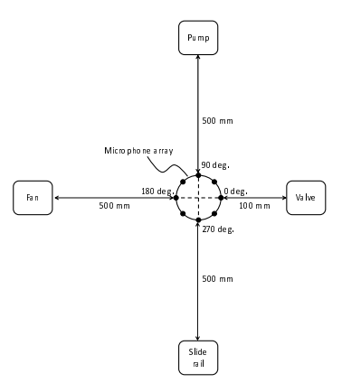
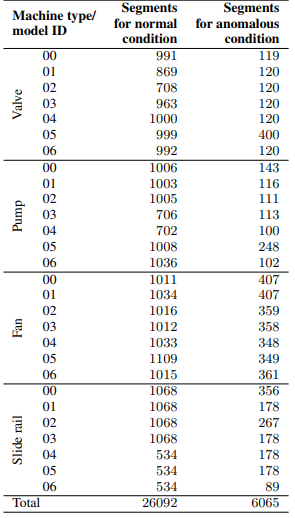
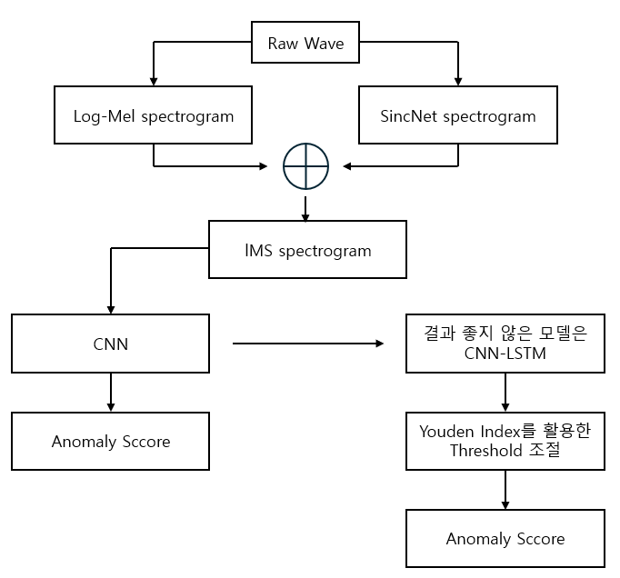
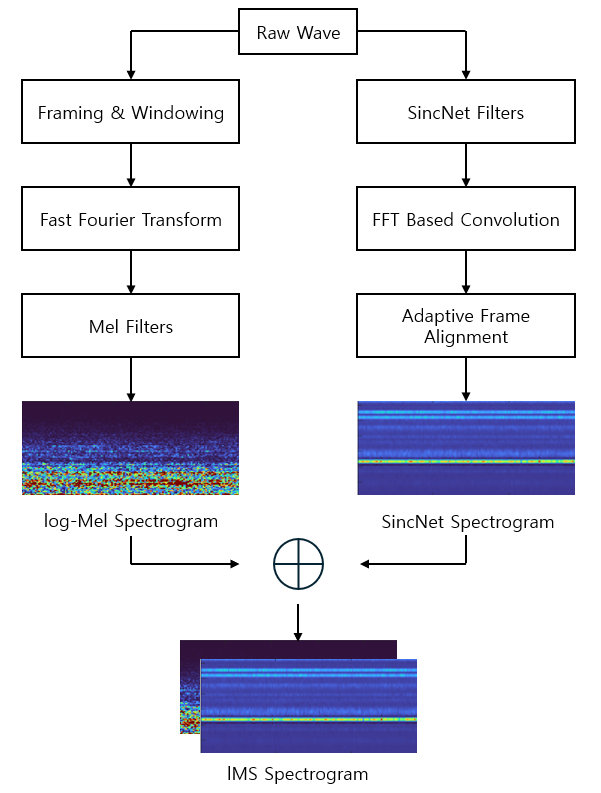
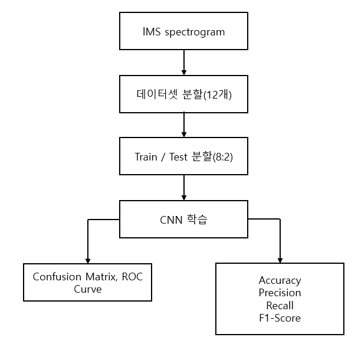
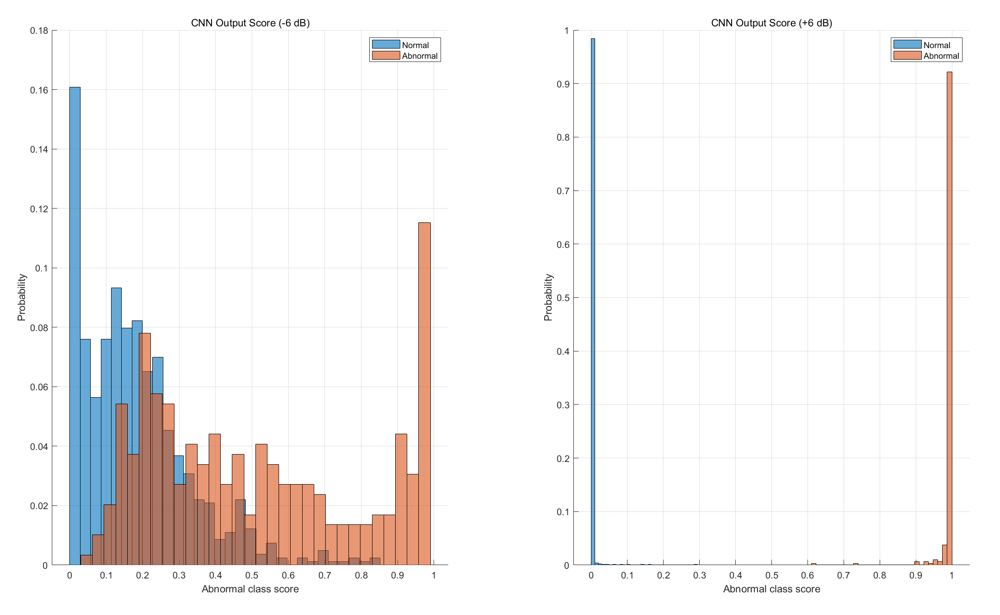
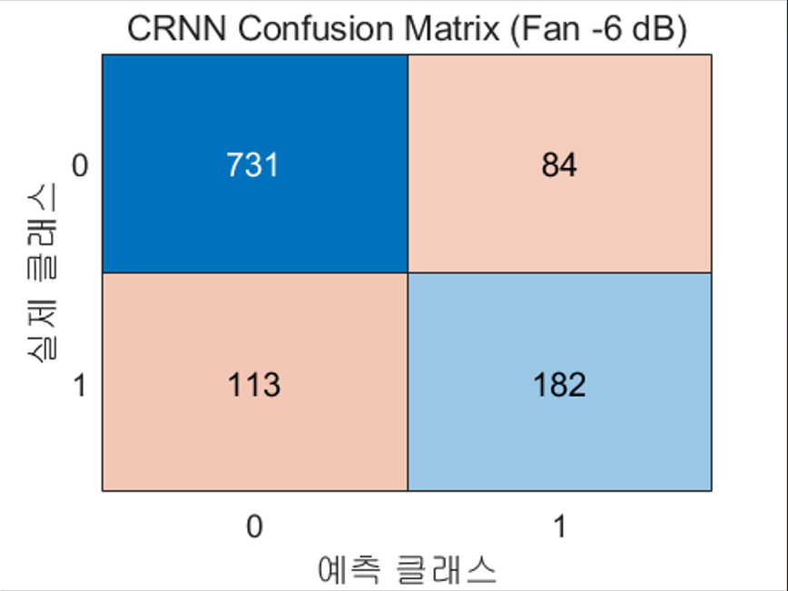
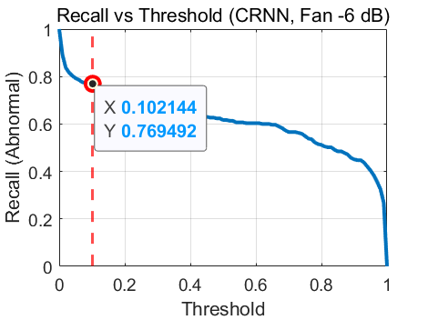
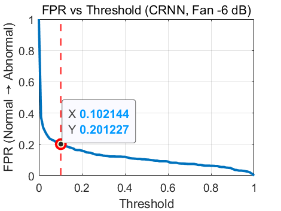

# Sound-Based Anomaly Detection using MIMII Audio Data

**Author:** 22000167 Kim Inyeop  
**Date:** December 23, 2025

---

## 1. Introduction

### 1.1 Problem Statement

In modern industrial environments, early detection of machine anomalies is essential for preventing unexpected failures, ensuring safety, and reducing maintenance costs. Traditional fault diagnosis systems rely heavily on physical sensors such as vibration, temperature, or current sensors. Although effective, these approaches are expensive to install and maintain and often require intrusive access to machinery.

Sound-based anomaly detection has emerged as a promising alternative because acoustic signals naturally reflect internal machine conditions and can be collected non-invasively at low cost. However, real industrial environments are highly noisy, and background noise often masks the acoustic characteristics of abnormal machine behavior. This significantly degrades the performance of conventional sound-based anomaly detection methods.

To address this problem, this report presents an implementation and analysis of a previously proposed noise-robust anomaly detection model that utilizes a **Deep Denoising Autoencoder (DDAE)**.

### 1.2 Dataset

The **MIMII (Malfunctioning Industrial Machine Investigation and Inspection) dataset** used in this study was collected by a company, **Hitachi**, and consists of sounds recorded from industrial machinery operating in real-world environments. The dataset includes four types of industrial machines: **valves, pumps, fans, and slide rails**, and each machine type is composed of multiple product models, referred to as machine IDs. In addition to normal operating sounds, the dataset incorporates a variety of anomalous conditions that commonly occur in real industrial settings, such as **contamination, leakage, rotating unbalance, and rail damage**.

|                  |
| :-------------------------------------------------------------: |
| **Figure 1.** Recording Setup for Collecting Machine Sound Data |

The audio data were recorded using an **eight-channel circular microphone array**, and the recording setup is illustrated in **Figure 1**. Each audio sample is provided as a single **10-second segment** and was recorded at a **sampling rate of 16 kHz**. To simulate realistic factory noise conditions, background noise collected from multiple real factories was mixed with the target machine sounds, resulting in audio data with three different signal-to-noise ratio (SNR) levels: **6 dB, 0 dB, and −6 dB**. These correspond to low-noise, moderate-noise, and high-noise industrial environments, respectively.

|         |
| :----------------------------------------: |
| **Table 1.** MIMII Dataset Content Details |

**Table 1** shows the number of audio segments available for normal and anomalous operating conditions.

## 2. Preprocessing

### 2.1 Abstract
In this project, we propose an lMS spectrogram-based abnormal sound detection method that combines the complementary characteristics of log-Mel spectrograms and SincNet spectrograms to effectively detect abnormal sounds generated in industrial facilities. The overall architecture is shown in Figure 2. This project referenced the paper ***A Machine Anomalous Sound Detection Method Using the lMS Spectrogram and ES-MobileNetV3 Network*** for the process of generating the lMS Spectrogram.

|  |
| :-----------------------------------: |
|     **Figure 2.** Project Diagram     |
Also the final goal is set as follows.

|  |
| :--------------------------------: |
|   **Figure 3.** Goal of Project    |
### 2.2 Feature Extraction

Extracting acoustic features is a crucial step in detecting abnormal acoustic signals. Therefore, extracting an lMS spectrogram, which combines the strengths of the log-Mel spectrogram, which excels at low-frequency regions, and the SincNet spectrogram, which offers high frequency selectivity and allows for localized observation, can significantly improve performance. The feature extraction diagram is shown in Figure 4.

|  |
| :----------------------------------------------------: |
|        **Figure 4.** Feature Extraction Diagram        |

### 2.3 log-Mel Spectrogram

- **A. Mono Signal Conversion**
	Before proceeding with Log-Mel Feature Extraction, the dataset is in the form of an 8-Channel Mic Array. Because it's multi-channel audio, it was converted to a mono signal to reduce variability due to information overlap and phase differences between channels.
	$$
x_{\text{mono}}(n) = \frac{1}{C}\sum_{c=1}^{C} x_c(n), \quad C = 8
$$
- **B. Specify Window & Hop Size**
	Window Size was set to 1024 to provide sufficient frequency resolution in FFT-based frequency analysis, and Hop Size was set to 50% overlap (512) to minimize information loss between frames.

- **C. FFT & Power Spectrum**
	Now, we apply FFT to each frame to transform it into the frequency domain. This obtains the time-frequency spectrum.
$$
X(k) = \sum_{n=0}^{N-1} x_{\text{mono}}(n)\, e^{-j \frac{2\pi k n}{N}}, 
\quad 0 \le k \le N-1
$$
$$
\text{Power Spectrum} = |X(k)|^2
$$
- **D. Applying 128 Mel Filter**
	The power spectrum is calculated by squaring the absolute value of the FFT result, then a Mel filter is applied to generate a Mel Spectrogram. The Mel scale reflects the characteristics of human hearing, providing high resolution in the low-frequency range (M=128).
$$
S_m = \sum_{k=0}^{N-1} |X(k)|^2\, H_m(k),
\quad 0 \le m \le M
$$
- **E. Log-Mel Spectrogram Extraction & Frame Alignment**
	We apply a logarithmic scale to the Mel Spectrogram to compress the dynamic range. The "ε" value is a constant to prevent divergence, which occurs when log(0) is used. Furthermore, because the number of frames generated varies depending on the audio length, the time axis length is fixed to 311. This process ensures that all samples have the same dimensionality.
$$
\log\text{-Mel}(m,t) = \log_{10}\!\left(S(m,t) + \varepsilon\right),
\quad \varepsilon = 10^{-6}
$$
### 2.4 SincNet Spectrogram

- **A. Mono signal conversion and band-pass filter application**
	For the same dimensionality, the 8-channel audio signal is converted to a mono signal, similar to the log-Mel Spectrogram, and SincNet uses a band-pass filter that learns only the low- and high-frequency cutoff frequencies. The frequency response of the band-pass filter is as follows.
$$
G(f, f_1, f_2)
=
\operatorname{rect}\!\left(\frac{f}{2f_2}\right)
-
\operatorname{rect}\!\left(\frac{f}{2f_1}\right)
$$
	If we inversely transform this, it becomes a sinc filter in the time domain.

$$
g(n; f_1, f_2)
=
2f_2\, \mathrm{sinc}\!\left(2\pi f_2 n\right)
-
2f_1\, \mathrm{sinc}\!\left(2\pi f_1 n\right)
$$
$$
\mathrm{sinc}(x) = \frac{\sin(x)}{x}
$$
	In this project, Filter Length L=251 and Number of Filters K=40 were used.

- **B. Convolution & Feature Map Creation**
	Perform convolution with each sinc filter on the input signal x(n). In this project, FFT-based convolution was used.
$$
x_k(n) = x(n) * g_k(n),
\quad k = 1,2,\ldots,40
$$
- **C. STFT and Frame Alignment**
	After applying the STFT to each output filter signal (N=1024, STFT length), the magnitude is calculated. The magnitude is then averaged along the time axis and converted to a fixed-length vector. Similarly, all time frames are normalized to 311.
$$
X_f(k,t)
=
\sum_{n} x_k(n)\,\omega(n-t)\,
e^{-j \frac{2\pi k n}{N}}
$$
$$
S_f(t)
=
\frac{1}{K}\sum_{k} \left|X_f(k,t)\right|
$$
### 2.5 lMS Spectrogram

At this stage, the lMS Spectrogram is created by fusing the log-Mel Spectrogram and SincNet Spectrogram. The formula is as follows.
$$
F_{\text{IMS}}
=
\operatorname{Concatenate}\!\left(
F_{\text{log-Mel}},\;
F_{\text{SincNet}}
\right)
$$

## 3. Dataset Split & Train / Test

In this step, the previously generated lMS spectrogram is divided into 12 models, categorized by machine type (fan, pump, slider, valve) and signal-to-noise ratio (-6 dB, 0 dB, 6 dB). CNN-based learning is then performed on each model, and the final performance is tested. This process is illustrated in Figure 5.

|  |
| :-----------------------------------------------: |
|        **Figure 5.** Train / Test Diagram         |
### 3.1 Dataset partitioning

The dataset was divided into 12 groups based on the machine (Fan, Pump, Slider, Valve) and signal-to-noise ratio (-6dB, 0dB, 6dB). This resulted in the following 12 datasets:
- fan_dbm6, fan_db0, fan_dbp6
- pump_dbm6, pump_db0, pump_dbp6
- pump_dbm6, pump_db0, pump_dbp6
- valve_dbm6, valve_db0, valve_dbp6
Normal samples are assigned 0, and abnormal samples are assigned 1.

### 3.2 Train/Test Split & CNN-Based Learning

For each dataset, the training and evaluation data were split by maintaining the ratio of normal and abnormal classes. The training and test data ratio was set to 8:2, and random shuffling was performed within each class to eliminate order bias. The CNN training parameters were as follows:
- Optimizer: Adam
- Initial learning rate: 1×10⁻³
- Mini-batch size: 32
- Number of epochs: 60
- Data shuffling: every epoch
- Loss function: categorical cross-entropy
Data shuffling was performed after each epoch during training to prevent overfitting.

### 3.3 Evaluation

The 12 trained models were evaluated using the corresponding metrics.
- Confusion Matrix
- ROC Curve and AUC
- Accuracy (the proportion of all samples correctly classified)
- Precision (the proportion of samples predicted as abnormal that are actually abnormal)
- Recall (the proportion of actual abnormal samples correctly detected by the model)
- F1-Score (the harmonic mean of Precision and Recall)

**Table 2.** Performance evaluation by model

| **Machine** | **SNR** | **Accuracy** | **Precision** | **Recall** | **F1-Score** |  **AUC**  |
| :---------: | :-----: | :----------: | :-----------: | :--------: | :----------: | :-------: |
|     Fan     |  -6dB   |    0.8324    |    0.8303     |  *0.4644*  |    0.5957    |  *0.850*  |
|     Fan     |   0dB   |    0.9676    |    0.9744     |   0.9017   |    0.9366    |   0.993   |
|     Fan     |   6dB   |    1.0000    |    1.0000     |   1.0000   |    1.0000    | **1.000** |
|    Pump     |  -6dB   |    0.9691    |    0.8837     |   0.8261   |    0.8539    |   0.946   |
|    Pump     |   0dB   |    0.9691    |    0.8300     |   0.9022   |    0.8646    |   0.982   |
|    Pump     |   6dB   |    0.9941    |    1.0000     |   0.9457   |    0.9721    | **0.992** |
|   Slider    |  -6dB   |    0.9915    |    0.9942     |   0.9663   |    0.9801    | **1.000** |
|   Slider    |   0dB   |    0.9890    |    1.0000     |   0.9494   |    0.9741    |   0.998   |
|   Slider    |   6dB   |    1.0000    |    1.0000     |   1.0000   |    1.0000    | **1.000** |
|    Valve    |  -6dB   |    0.9988    |    0.9897     |   1.0000   |    0.9948    | **1.000** |
|    Valve    |   0dB   |    0.9988    |    1.0000     |   0.9897   |    0.9948    | **1.000** |
|    Valve    |   6dB   |    0.9988    |    1.0000     |   0.9897   |    0.9948    | **1.000** |
Data evaluation results showed that, in general, lower noise levels (6 dB) resulted in higher classification accuracy and a correspondingly higher AUC. In particular, Slider and Valve both demonstrated excellent classification performance regardless of the signal-to-noise ratio. However, the -6 dB Fan significantly degraded Recall performance, resulting in a low AUC of 0.850.

## 4. Problem Analysis and CNN-LSTM Training

As seen in the results in Table 1, the recall performance of the -6dB Fan was significantly worse than that of the other models. This was largely categorized into two reasons. First, the -6dB Fan has a large overlap between the Normal and Abnormal Score distributions. For well-classified models, the Abnormal Score of the normal model is typically low, while that of the abnormal model is typically high. This is clearly evident in Figure 6 below, where left represents the -6dB Fan and right represents the 6dB Fan.

|          |
| :-------------------------------------------------: |
| **Figure 6.** -6dB(left), 6dB(right) Abnormal Score |
A second problem is that CNNs fail to properly reflect the temporal context of data. In particular, in the case of Fans, abnormal patterns often appear at regular intervals during rotation. To reflect this characteristic, we used a CNN-LSTM-based time-series classification model that integrates features extracted by CNNs into a chronological order.

### 4.1 CNN-LSTM concept

CNN-based models can effectively extract spatial features of individual frames, but they have limitations in directly modeling continuous temporal change patterns. To address these limitations, this study introduced LSTM to learn temporal dependencies between frames.

### 4.2 Structure of CNN-LSTM

The feature sequence extracted from CNN was used as input to LSTM, and after processing the entire sequence, the hidden state of the last time-step was used to determine whether it was normal or abnormal. Finally, the Youden Index was used to adjust the threshold to achieve the best classification performance. This project referenced the papers ***Deep Convolutional and LSTM Recurrent Neural Networks for Multimodal Wearable Activity Recognition*** and ***Youden Index and Optimal Cut-Point Estimated from Observations Affected by a Lower Limit of Detection.***

## 5. Experimental Results

In this project, we trained a CNN-LSTM-based anomaly detection model using LM spectrograms as input and evaluated the final detection performance through threshold optimization using the Youden index.
Our analysis focused specifically on the potential for improved detection performance in low-signal-to-noise environments.

### 5-1. CNN–LSTM-based anomaly detection performance

The CNN-LSTM model is designed to extract spatial features in the time-frequency domain through a CNN, and then learn temporal dependencies between consecutive frames through an LSTM. In environments with low energy and significant background noise, such as the −6 dB Fan condition, temporal pattern accumulation is more important than single-frame-based classification. The LSTM layer reflects this temporal continuity, enabling more reliable detection even when abnormal signals appear gradually. Experimental results showed that the CNN-LSTM model exhibited a decrease in Accuracy and Precision under the −6 dB Fan condition, but improved Recall and F1-score. The ROC curve also shifted toward the upper left, confirming an increase in AUC.

|        |      |
| :----------------------------------------: | :--------------------------------------------: |
|  |  |
|      **Figure 7A.** -6dBfan(CNN only)      |        **Figure 7B.** -6dBfan(CNN-LSTM)        |

**Table 3.** Performance evaluation CNN vs CNN-LSTM

| **-6dB Fan**  | **CNN only** | **CNN-LSTM** |
| :-----------: | :----------: | :----------: |
| **Accuracy**  |    0.8324    |    0.8225    |
| **Precision** |    0.8303    |    0.6842    |
|  **Recall**   |    0.4644    |    0.6169    |
| **F1-Score**  |    0.5957    |    0.6488    |
|    **AUC**    |    0.850     |    0.8668    |
### 5-2. Youden Index-based Threshold Calculation Method

The CNN-LSTM model uses the softmax output to calculate a probability value for the anomalous class for each input sample. However, a fixed threshold (e.g., 0.5) may not be the optimal discriminant criterion depending on the class distribution and noise conditions. Therefore, in this study, the threshold was determined based on data using the Youden index. The Youden index is defined as follows:
$$
J = \mathrm{TPR} - \mathrm{FPR}
$$
Here, TPR (True Positive Rate) refers to Recall, and FPR (False Positive Rate) indicates the probability that a normal sample is misclassified as abnormal. The threshold for deriving the optimal Youden Index was determined to be 0.102.

|      |  |
| :-------------------------------------: | :---------------------------------: |
| **Figure 8A.** TPR(Recall) vs Threshold |   **Figure 8B.** FPR vs Threshold   |

### 5-3. CNN vs CNN-LSTM vs Youden Index based Threshold

Applying a Youden index-based threshold to the CNN-LSTM model resulted in additional recall improvements compared to the default softmax criterion. This was achieved by selecting the operating threshold at the point that maximizes the difference between the False Positive Rate (FPR) and True Positive Rate (TPR), thereby enhancing anomaly detection sensitivity. However, lowering the threshold also resulted in an increase in the number of normal samples being classified as anomalous, resulting in a decrease in precision.

| **-6dB Fan**  | **CNN only** | **CNN-LSTM** | Youden Index based Threshold |
| :-----------: | :----------: | :----------: | :--------------------------: |
| **Accuracy**  |    0.8324    |    0.8225    |            0.7919            |
| **Precision** |    0.8303    |    0.6842    |            0.5821            |
|  **Recall**   |    0.4644    |    0.6169    |            0.7695            |
| **F1-Score**  |    0.5957    |    0.6488    |            0.8688            |
|    **AUC**    |    0.850     |    0.8668    |            0.867             |
To summarize, each step has the following clear trade-off relationship:

- **CNN → CNN-LSTM**
    
    - Advantages: Improved performance in detecting temporal anomalies (increased Recall, F1-score)
        
    - Disadvantages: Increased model complexity and computational cost.
        
- **CNN-LSTM → Youden-based Threshold**
    
    - Advantage: Maximizes anomaly detection sensitivity (recall)
        
    - Cons: Increased likelihood of false positives (reduced precision)
        

Therefore, the results of this study suggest that model structure improvement (CNN-LSTM) and criterion optimization (Youden index) have different levels of trade-offs, and that in real-world industrial applications, the appropriate combination should be selected based on operational objectives (minimizing false alarms vs. minimizing non-detections).

## 6. Reference

1. Wang, M., Mei, Q., Song, X., Liu, X., Kan, R., Yao, F., Xiong, J., & Qiu, H. (2023). _A machine anomalous sound detection method using the lMS spectrogram and ES-MobileNetV3 network_. **Applied Sciences, 13**(23), 12912. [https://doi.org/10.3390/app132312912](https://doi.org/10.3390/app132312912)

2. **Ordóñez, F. J., & Roggen, D. (2016).** _Deep Convolutional and LSTM Recurrent Neural Networks for Multimodal Wearable Activity Recognition._ Sensors, _16_(1), 115. [https://doi.org/10.3390/s16010115](https://doi.org/10.3390/s16010115)

3. **Ruopp, M. D., Perkins, N. J., Whitcomb, B. W., & Schisterman, E. F. (2008).** Youden index and optimal cut-point estimated from observations affected by a lower limit of detection. _Biometrical Journal_, _50_(3), 419–430. [https://doi.org/10.1002/bimj.200710415](https://doi.org/10.1002/bimj.200710415) (PMCID PMC2515362)