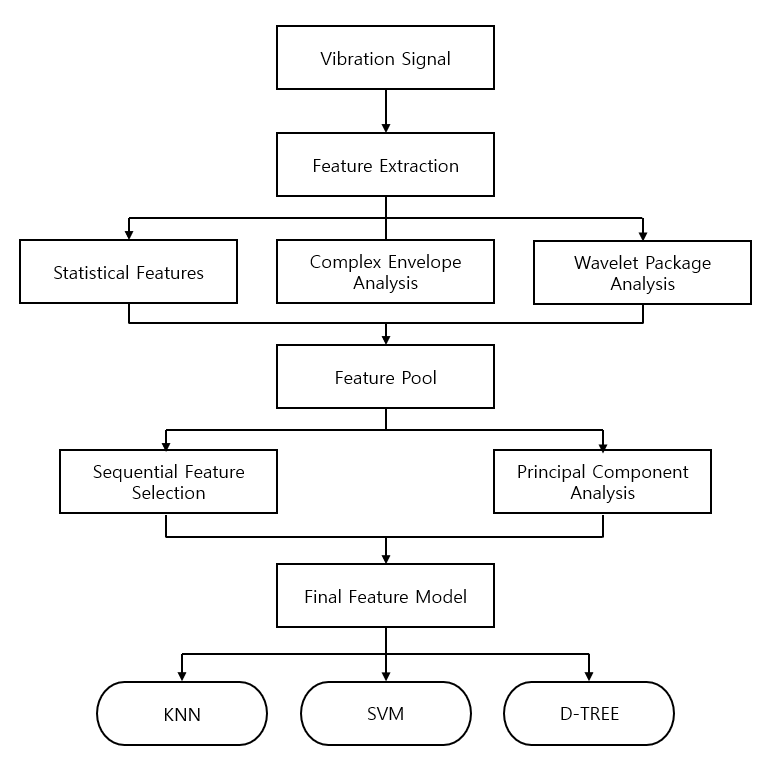

# PHM implementation by HGU Bearing Dataset

22000167 Kim inyeop
## 1. Introduction

In rotating machinery, bearings are key mechanical components, and when they fail, abnormal vibration patterns appear. Early detection of these abnormal signals is crucial for preventing equipment failures and reducing maintenance costs.

In this project, we will use HGU Bearing Dataset.

- Time-domain statistical features
- Envelope-based fault frequency features
- Wavelet packet energy features

are integrated and extracted, and **KNN, SVM, and Decision Tree** classifiers are applied to classify bearing fault conditions. Furthermore, the impact of feature selection on classification performance is analyzed using **Sequential Feature Selection (SFS)** and **PCA-based dimensionality reduction**.

|  |
| :------------------------------------------------: |
|          **Figure 1.** Experiment Diagram          |

## 2. Dataset

### 2-1 Description of the HGU Bearing Dataset

The HGU Bearing Dataset is a small-scale ball bearing vibration acceleration dataset collected in a laboratory environment, covering bearings in both normal and various fault conditions. This dataset was designed to evaluate the performance of bearing fault diagnosis algorithms.

### 2-2 Experimental device configuration

The experiments were conducted on a self-built test rig using a 1.4 kW AC servo motor (HG-KR43J) as the drive source. The test rig for evaluating motor performance consists of the following components:

- AC servo motor (HG-KR43J, 1.4 kW)
- Gearbox (1:100)
- Gearbox (50:1)
- Torque transducer (UTM2-10 Nm)
- Acceleration sensor (PCB-(M)352C66)

The bearing was mounted to support the motor shaft, and the vibration signal was measured using the acceleration sensor.

### 2-3 Bearing Defect Types

The bearing defect was artificially created at a single point using Electrical Discharge Machining (EDM). The defect sizes are as follows:

- **Inner race defect**

	- 직경: 1 mm
	- 깊이: 2.3 mm

- **Outer race defect**

	- Diameter: 1 mm
	- Depth: 2.3 mm

- **Ball defect**

	- Diameter: 1 mm
	- Depth: 1 mm

- **Bearing geometric parameters**

$$
D_1 = 37.05,\quad
D_2 = 24.95,\quad
N_B = 13,\quad
\beta = 6.05^\circ
$$

---

### 2-4 **Additional Defect Conditions**

In addition to bearing defects, the test rig can also apply shaft misalignment and load imbalance defects.

- **shaft misalignment**

	- Alignment condition
	- Misalignment condition: 1 mm, 2 mm

- **load imbalance**

	- Balance disk
	- Unbalance disk

- **Data acquisition conditions**

	- Rotation speed: **500 rpm**
	- Sampling frequency: **12 kHz**
	- Measurement time: **10**** seconds**
	- Data format: **MATLAB (.mat)**
	- File name: HGU_bearing_dataset_v1.mat

For each experimental condition, acceleration signals were continuously measured for 10 seconds.

### 2-5 Bearing condition classification

The condition of the bearing is classified into a total of 8 classes depending on the shaft alignment condition.

| Defect Type  | Alignment Status | Misalignment Status |
| :----------: | :--------------: | :-----------------: |
|    Normal    |        N1        |         N2          |
| Inner Defect |        I1        |         I2          |
| Outer Defect |        O1        |         O2          |
| Ball Defect  |        B1        |         B2          |

### 2-6 Data Composition and Segmentation

The raw acceleration signal (bearing_acc) was augmented with a window size of 12,000 and a stride of 1,000. A total of 108 data samples were generated for each class, which were split at an 8:2 ratio for training and validation.

- Training data: 87 samples per class
- Test data: 21 samples per class

**Total data count**

| Class | Training Data | Test Data |
| :---: | :-----------: | :-------: |
|  N1   |      87       |    21     |
|  N2   |      87       |    21     |
|  I1   |      87       |    21     |
|  I2   |      87       |    21     |
|  O1   |      87       |    21     |
|  O2   |      87       |    21     |
|  B1   |      87       |    21     |
|  B2   |      87       |    21     |
| Total |      696      |    168    |

## 3. Preprocessing

This project uses multiple features to effectively extract defect characteristics from bearing vibration signals. Preprocessing can be categorized into three categories: Statistical Features, Complex Envelope, and Wavelet Packet. The total number of features is 39.

### 3-1. Statistical Features

Statistical features are a method for numerically representing the fundamental distribution characteristics and variability of a signal in the time domain. These features are widely used in fault diagnosis because they are simple to calculate and sensitive to changes in bearing condition. The main statistical features are as follows:

**Time domain (10 features)**

- RMS
- Square Root Amplitude (SRA)
- Kurtosis
- Skewness
- Peak-to-Peak
- Crest factor
- Impulse factor
- Margin factor
- Shape factor
- Kurtosis factor

$$
X_{\mathrm{rms}} =
\left(
\frac{1}{N}\sum_{i=1}^{N} x_i^2
\right)^{1/2}
$$
$$
X_{\mathrm{sra}} =
\left(
\frac{1}{N}\sum_{i=1}^{N} \sqrt{|x_i|}
\right)^2
$$
$$
X_{\mathrm{kv}} =
\frac{1}{N}\sum_{i=1}^{N}
\left(
\frac{x_i-\bar{x}}{\sigma}
\right)^4
$$
$$
X_{\mathrm{sv}} =
\frac{1}{N}\sum_{i=1}^{N}
\left(
\frac{x_i-\bar{x}}{\sigma}
\right)^3
$$
$$
X_{\mathrm{ppv}} =
\max(x_i)-\min(x_i)
$$
$$
X_{\mathrm{cf}} =
\frac{\max(|x_i|)}
{\left(
\frac{1}{N}\sum_{i=1}^{N} x_i^2
\right)^{1/2}}
$$
$$
X_{\mathrm{if}} =
\frac{\max(|x_i|)}
{\frac{1}{N}\sum_{i=1}^{N}|x_i|}
$$
$$
X_{\mathrm{mf}} =
\frac{\max(|x_i|)}
{\left(
\frac{1}{N}\sum_{i=1}^{N}\sqrt{|x_i|}
\right)^2}
$$
$$
X_{\mathrm{sf}} =
\frac{\max(|x_i|)}
{\left(
\frac{1}{N}\sum_{i=1}^{N} x_i^2
\right)^{1/2}}
$$
$$
X_{\mathrm{kf}} =
\frac{
\frac{1}{N}\sum_{i=1}^{N}
\left(
\frac{x_i-\bar{x}}{\sigma}
\right)^4
}{
\left(
\frac{1}{N}\sum_{i=1}^{N} x_i^2
\right)^2
}
$$

**Frequency domain (3 features)**

- FC (Frequency Center)
- RMSF (Root Mean Square Frequency)
- RVF (Root Variance Frequency)

$$
X_{\mathrm{fc}} =
\frac{1}{N}\sum_{i=1}^{N} f_i
$$
$$
X_{\mathrm{rmsf}} =
\left(
\frac{1}{N}\sum_{i=1}^{N} f_i^2
\right)^{1/2}
$$
$$
X_{\mathrm{rvf}} =
\left(
\frac{1}{N}\sum_{i=1}^{N}
\left(f_i - X_{\mathrm{fc}}\right)^2
\right)^{1/2}
$$

These statistical features can effectively reflect increases in vibration energy and changes in signal distribution under fault conditions compared to normal conditions. Kurtosis and RMS, in particular, are useful indicators of increased impulsive components during bearing faults.

### 3-2. Complex Envelope Features

Complex envelope analysis is a method for extracting the periodic shock components (modulation) caused by bearing defects. In this study, the Hilbert Transform was applied to the vibration signal to generate a complex analytic signal. This provides the following information:

- Envelope Signal
- Envelope Spectrum

$$
\hat{h}(t)
=
\mathcal{H}\{h(t)\}
=
h(t) * \frac{1}{\pi t}
=
\frac{1}{\pi}
\int_{-\infty}^{\infty}
\frac{h(\tau)}{t-\tau}\, d\tau
$$
$$
h_a(t)
=
h(t) + i\,\hat{h}(t)
$$
$$
H_a(f)
=
\mathcal{F}\{h_a(t)\}
$$
$$
\left| H_a(f) \right|
=
\left| \mathcal{F}\{h_a(t)\} \right|
$$
$$
X_{\mathrm{rmsf}}
=
\left(
\frac{1}{N}
\sum_{i=1}^{N} f_i^2
\right)^{1/2}
$$
(RMSF is used to calculate the narrowband energy of the envelope spectrum)

The complex envelope is particularly effective in highlighting repetitive shock patterns occurring in inner race, outer race, and ball defects. Defect frequency components that may be obscured by noise in the original signal can be more clearly identified in the envelope domain.

### 3-3. Wavelet Packet Features

Wavelet packet analysis is a technique that decomposes a signal into multiple resolutions to simultaneously analyze features in the time and frequency domains. Because bearing defect signals exhibit non-stationary characteristics, wavelet packet analysis is particularly suitable. In this project, the vibration signal was decomposed into multiple frequency bands using wavelet packet decomposition, and the following features were extracted from each subband:

- Subband Energy (Wavelet Packet Energy)
- Energy Ratio
- Log Energy Value

$$
E_j(n)
=
\sum_{s=0}^{S/2^{j}-1}
\left( c_{j,n}^{\,s} \right)^2
$$
$$
x_n
=
\frac{E_j(n)}
{\sum_{m=0}^{2^{j}-1} E_j(m)}
$$

Wavelet packet-based features effectively reflect the phenomenon of energy concentration in specific frequency bands depending on the defect type. They are advantageous for detecting subtle defect signals that are difficult to detect using time-domain or single-frequency analysis.

### 3-4. Feature Pool

A feature pool was created based on the features extracted from 3-1 to 3-3. The feature pool consists of three categories of features:

- Statistical features: 13 features extracted from the time and frequency domains.
- Envelope features: 18 features composed of the amplitudes of the 1st to 6th harmonics of the fault frequencies (BPFI, BPFO, and BSF).
- Wavelet packet features: 8 subband energy features obtained through level 3 decomposition.

These features were integrated to create a feature pool consisting of a total of 39 features, which were used as input for the classifier.

### 3-5. Feature Normalization

Training with each feature results in a **feature pool (39 dimensions)** with different physical meanings and scales. Therefore, normalization is essential before classification learning. Otherwise, some features may dominate the learning process. The extracted features have significantly different value ranges, as shown below.

- Statistical features(Time domain): RMS, kurtosis, etc. (relatively small values)
- Statistical features(Frequency domain): Hundreds to thousands of Hz
- Envelope features: FFT amplitude-based (large values)
- Wavelet packet features: Energy-based (sum of squares → very large values)

This project applied **Z-score normalization**.
Normalization calculates the mean and standard deviation based on the training data, and applies the same values ​​to the test data to prevent data leakage.
$$
x_{\text{norm}} = \frac{x - \mu}{\sigma}
$$
μ: Mean of the training data
σ: Standard deviation of the training data

## 4. Baseline Classification

In this project, before applying feature selection or dimensionality reduction, we first evaluated the baseline performance using the entire extracted feature pool (39 dimensions). This was to establish a baseline for quantitatively comparing the performance improvements of subsequent SFS and PCA. Baseline classification performance was evaluated using the following three representative machine learning classifiers with different characteristics:

1) K-Nearest Neighbors (KNN)

KNN is a distance-based classifier in feature space and has the advantage of accurately reflecting local data distribution characteristics. In this study, the number of neighbors was set to 3.

2) Support Vector Machine (SVM)

SVM is a classifier that excels at classification in high-dimensional feature spaces. In this study, the RBF kernel was used and the Error-Correcting Output Codes (ECOC) structure was applied to handle multi-class problems.

3) Decision Tree

Decision trees are rule-based classifiers that offer high interpretability of the classification process. The model was trained with a minimum leaf node size of 5.

Performance Evaluation Metrics

Baseline classification performance was evaluated not based on a single metric, but rather comprehensively using the following performance metrics:

- Accuracy
- Precision (Macro-average)
- Recall (Macro-average)
- F1-score (Macro-average)
- AUC (One-vs-Rest, Macro-average)

By using the macro average, each bearing condition class was evaluated with equal weight. AUC was calculated using the One-vs-Rest method to account for the multi-class problem. Furthermore, a confusion matrix was used to visually analyze the classification performance for each class.

| Baseline  |  KNN   |  SVM   | Dtree  |
| :-------: | :----: | :----: | :----: |
| Accuracy  | 95.83  | 60.71  | 88.69  |
| Precision | 0.9581 | 0.6044 | 0.9004 |
|  Recall   | 0.9583 | 0.6071 | 0.8869 |
| F1-Score  | 0.9577 | 0.6022 | 0.8895 |
|    AUC    | 0.9862 | 0.9276 | 0.9770 |
Baseline experiment results showed that the KNN classifier performed best across all evaluation metrics. With an accuracy of 95.83% and an AUC of 0.9862, the KNN classifier effectively utilized the entire feature pool (39 dimensions). This indicates relatively clear separation between classes in the feature space.

Decision Tree showed relatively stable performance with an accuracy of 88.69% and an AUC of 0.9770, but showed increased misclassification in some classes compared to KNN.

Conversely, SVM showed relatively poor performance with an accuracy of 60.71%. This suggests that the RBF kernel-based SVM failed to sufficiently learn nonlinear boundaries between classes in the baseline feature space, suggesting potential for performance improvement through feature selection or dimensionality reduction techniques.

## 5. SFS

Baseline experiments revealed performance differences across classifiers. In particular, redundant or inefficient features within the entire feature pool (39 dimensions) were observed to potentially contribute to performance degradation in some classifiers. Therefore, this study applied the Sequential Forward Selection (SFS) technique to improve classification performance. SFS is a wrapper-based feature selection technique that starts from an empty feature set and adds the features that most significantly improve classification performance one by one. In this study, independent SFS was performed for each classifier (KNN, SVM, and Decision Tree) to directly reflect the classifier performance.

- Cross-validation method: 10-fold cross-validation
- Evaluation criterion: Minimizing classification error rate
- Input features: Same 39-dimensional feature pool as the baseline

Through this, different optimal feature subsets were derived for each classifier. Through this, different optimal feature subsets were derived for each classifier. Also the model performance is as follows.

| Baseline  |   KNN   |   SVM   |   Dtree   |
| :-------: | :-----: | :-----: | :-------: |
| Accuracy  |  95.83  |  60.71  |   88.69   |
| Precision | 0.9581  | 0.6044  |  0.9004   |
|  Recall   | 0.9583  | 0.6071  |  0.8869   |
| F1-Score  | 0.9577  | 0.6022  |  0.8895   |
|    AUC    | 0.9862  | 0.9276  |  0.9770   |
|  **SFS**  | **KNN** | **SVM** | **Dtree** |
| Accuracy  |  95.24  |  95.24  |   92.86   |
| Precision | 0.9572  | 0.9555  |  0.9317   |
|  Recall   | 0.9524  | 0.9524  |  0.9286   |
| F1-Score  | 0.9518  | 0.9522  |  0.9285   |
|    AUC    | 0.9869  | 0.9914  |  0.9715   |
The application of SFS resulted in a marked difference in performance across classifiers.

**KNN**
After applying SFS, accuracy remained largely unchanged, from 95.83% to 95.24%, and precision, recall, and F1-score also showed stable performance with little change. This suggests that KNN can sufficiently maintain its performance with only a small number of core features (5). AUC also improved slightly, from 0.9862 to 0.9869.

**SVM**
The largest performance improvement was observed after applying SFS. Accuracy significantly improved from 60.71% to 95.24%, and F1-score also increased dramatically, from 0.6022 to 0.9522. This suggests that unnecessary or redundant features in the baseline feature pool degraded SVM performance, and that SFS effectively learned classification boundaries by selecting only core features (8). AUC also significantly improved, from 0.9276 to 0.9914.

**Decision Tree**
After applying SFS, accuracy improved from 88.69% to 92.86%, and precision, recall, and F1 scores also improved across the board. This demonstrates that Decision Tree mitigates overfitting and improves generalization performance when using an intermediate number of features (6).

## 6. PCA

After selecting key features important for the classifier through SFS, this study additionally applied Principal Component Analysis (PCA), a dimensionality reduction-based approach, to analyze performance changes. PCA linearly combines original features to transform them into a low-dimensional feature space that preserves variance as much as possible. PCA was applied according to the following procedure:

- Input data: Feature set after normalization and feature refinement (low variance, high correlation removal)

- Criteria: Automatically select the minimum number of dimensions that explain at least 95% of the cumulative variance

- Transformation method:

	- Principal components were calculated from the training data
	- The same transformation was applied to the test data to prevent data leakage.

Thus, the high-dimensional feature space was reduced to a more compact, low-dimensional space. Ultimately, the dimensions were reduced from 39 to 18.

| Baseline  |   KNN   |   SVM   |   Dtree   |
| :-------: | :-----: | :-----: | :-------: |
| Accuracy  | 0.9583  | 0.6071  |  0.8869   |
| Precision | 0.9581  | 0.6044  |  0.9004   |
|  Recall   | 0.9583  | 0.6071  |  0.8869   |
| F1-Score  | 0.9577  | 0.6022  |  0.8895   |
|    AUC    | 0.9862  | 0.9276  |  0.9770   |
|  **SFS**  | **KNN** | **SVM** | **Dtree** |
| Accuracy  | 0.9524  | 0.9524  |  0.9286   |
| Precision | 0.9572  | 0.9555  |  0.9317   |
|  Recall   | 0.9524  | 0.9524  |  0.9286   |
| F1-Score  | 0.9518  | 0.9522  |  0.9285   |
|    AUC    | 0.9869  | 0.9914  |  0.9715   |
|  **PCA**  | **KNN** | **SVM** | **Dtree** |
| Accuracy  | 0.9464  | 0.9583  |  0.8929   |
| Precision | 0.9461  | 0.9603  |  0.8980   |
|  Recall   | 0.9464  | 0.9583  |  0.8929   |
| F1-Score  | 0.9460  | 0.9584  |  0.8932   |
|    AUC    | 0.9851  | 0.9964  |  0.9534   |
**Comparative analysis of the results of applying SFS and PCA**

**KNN**

After applying SFS, KNN's accuracy remained virtually unchanged, from 95.83% to 95.24%. Precision, Recall, and F1-score also maintained stable performance with little change. This suggests that KNN can maintain sufficient classification performance even with a small number of core features (5). The AUC also improved slightly, from 0.9862 to 0.9869.

Conversely, when PCA was applied, the feature dimensionality was reduced from 39 to 18, but the accuracy decreased slightly, from 95.24% to 94.64%. This is interpreted as a result of the fact that, as a distance-based classifier, KNN relies on the individual physical meaning and scale information of the original features, and this information is partially lost during the linear transformation process of PCA. Therefore, SFS is a more suitable feature optimization method than PCA for KNN.

**SVM**

The greatest performance improvement was observed in SVM after applying SFS. Accuracy significantly improved from 60.71% to 95.24%, and the F1-score also increased dramatically from 0.6022 to 0.9522. This suggests that unnecessary or redundant features in the baseline feature pool hindered decision boundary learning by the SVM, and that classification boundaries were effectively learned by selecting only the **core features (8)** through SFS. The AUC also significantly improved from 0.9276 to 0.9914.

When PCA was applied, despite reducing the feature dimension from 39 to 18, accuracy was 95.83% and AUC was 0.9964, achieving the highest performance among all experiments. This suggests that SVM excels at decision boundary learning in high-dimensional feature spaces and can effectively classify in low-dimensional spaces where redundant information is removed through PCA. Consequently, PCA emerged as the most effective approach in terms of performance for SVM.

**Decision Tree**

In the decision tree, accuracy improved from 88.69% to 92.86% after applying SFS, and precision, recall, and F1-score also improved across the board. This demonstrates that the intermediate number of features (6) selected through SFS helped alleviate decision tree complexity and reduce overfitting.

Conversely, applying PCA resulted in an accuracy of 89.29%, showing no significant improvement over the baseline and lower performance than the SFS-based model. This suggests that because decision trees rely heavily on individual splitting criteria of the original features, linear combination-based feature transformations like PCA can degrade the model's interpretability and classification performance. Therefore, SFS is considered a more effective approach than PCA for decision trees.